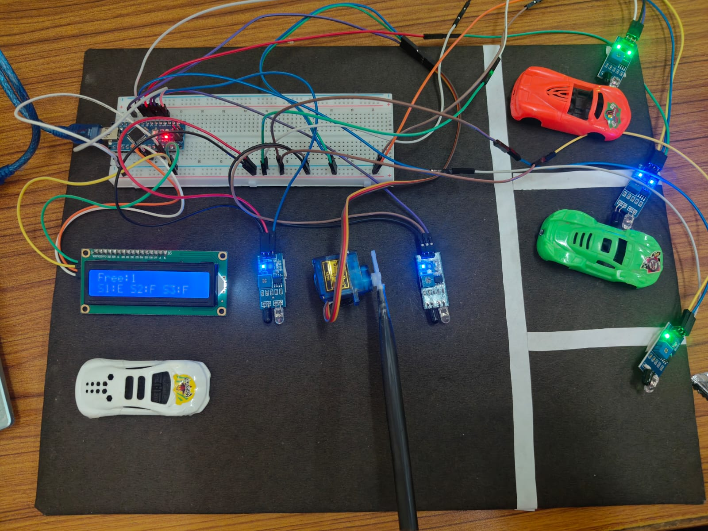
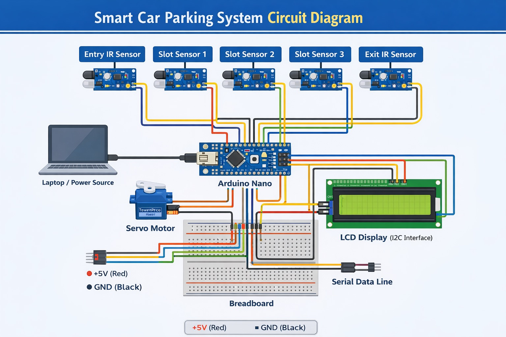
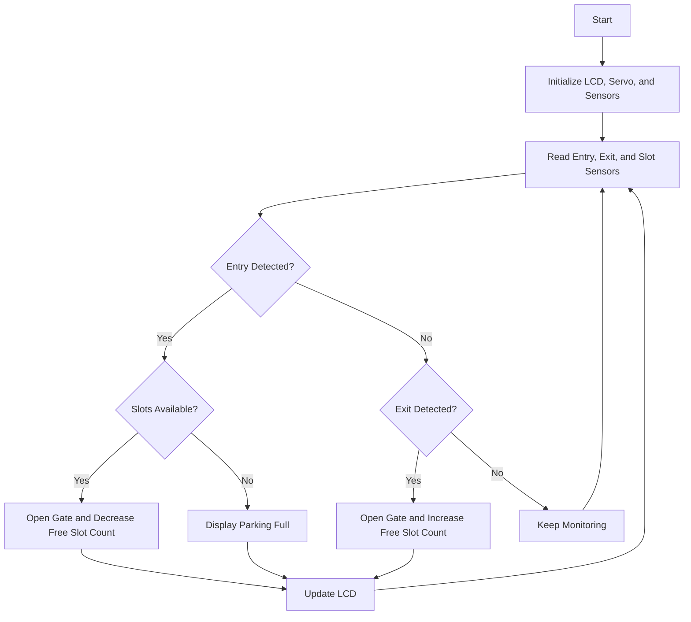

# Smart Car Parking System

An Arduino Nano based embedded systems project that automates basic parking management using IR sensors, a servo motor, and a 16x2 I2C LCD. The system detects vehicles at the entry and exit, tracks the occupancy of 3 parking slots, opens the gate when space is available, and shows live slot status on the display.

## Overview

The Smart Car Parking System is a compact and low-cost prototype for parking automation. It combines sensor-based vehicle detection with real-time processing on an Arduino Nano to manage gate access and parking slot availability.

This project demonstrates practical hardware and software integration for embedded systems using Arduino C++ and commonly available components.

## Features

- Real-time vehicle detection using IR sensors
- Occupancy monitoring for 3 parking slots
- Automatic gate control using a servo motor
- Live slot availability display on a 16x2 I2C LCD
- Entry and exit detection logic for accurate slot tracking
- Compact prototype built using Arduino Nano and breadboard components

## Hardware Components

- Arduino Nano
- IR sensors for entry and exit detection
- 3 IR sensors for parking slot monitoring
- Servo motor for gate control
- 16x2 LCD with I2C module
- Breadboard
- Jumper wires
- Power supply or laptop USB power

## Software and Tools

- Arduino IDE
- Embedded C++ (Arduino)

### Libraries Used

- `Wire.h` for I2C communication
- `LiquidCrystal_I2C.h` for LCD control
- `Servo.h` for gate control

## Project Images

### Prototype Setup



### Circuit Diagram



## System Architecture

The system works in three layers:

### Input Layer

- IR sensors detect vehicle entry and exit
- Slot sensors identify whether each parking slot is free or occupied

### Processing Layer

- Arduino Nano reads sensor input using `digitalRead()`
- The controller updates the available slot count
- The logic decides whether to open the gate or show `Parking Full`

### Output Layer

- Servo motor opens and closes the gate
- LCD displays the number of free slots and slot-wise parking status

## Working Principle

1. The Arduino Nano initializes the LCD, servo motor, and IR sensors.
2. Slot sensors continuously check the status of all 3 parking slots.
3. When a vehicle approaches the entry:
   - if a slot is available, the servo opens the gate
   - the vehicle enters and the available slot count is updated
4. When a vehicle leaves:
   - the exit logic updates the slot count
   - the gate opens briefly and then closes
5. The LCD continuously shows live parking availability and slot status.

If all slots are occupied, the system displays `Parking Full` and keeps the gate closed for new entries.

## Control Flow



## Code Overview

The Arduino program is responsible for:

- reading sensor states using `digitalRead()`
- identifying whether a car is entering or exiting
- monitoring the occupancy of 3 parking slots
- controlling the servo motor using `Servo.h`
- updating the LCD through I2C communication

Example library setup:

```cpp
#include <Wire.h>
#include <LiquidCrystal_I2C.h>
#include <Servo.h>
```

## Sample LCD Output

```text
Free: 1
S1:E S2:F S3:F
```

Here:

- `E` means Empty
- `F` means Filled

## Applications

- Smart parking prototypes for academic projects
- Residential parking automation
- Office and campus parking management
- Embedded systems and automation learning projects

## Future Improvements

- Mobile app integration for remote monitoring
- Cloud-based parking analytics
- Number plate recognition using computer vision
- Ultrasonic sensors for improved detection accuracy
- IoT integration for smart city applications

## Learning Outcomes

- Practical understanding of sensor interfacing
- Hands-on experience with Arduino Nano based embedded systems
- Implementation of real-time control logic
- Integration of hardware and software in a working automation project

## How to Run

1. Assemble the hardware according to the circuit connections.
2. Open the Arduino sketch in Arduino IDE.
3. Install the required libraries.
4. Upload the code to the Arduino Nano.
5. Power the system using USB or an external supply.
6. Test the setup by moving toy cars or objects near the sensors.

## Contributing

Suggestions and improvements are welcome. You can extend the project by improving the sensor logic, adding IoT support, or scaling it to support more parking slots.

## License

This project is open source and available under the MIT License.
